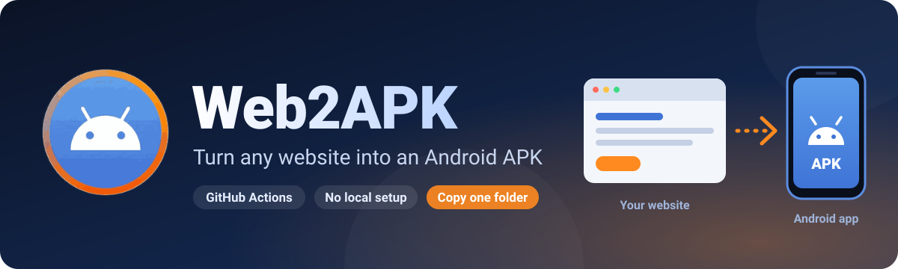
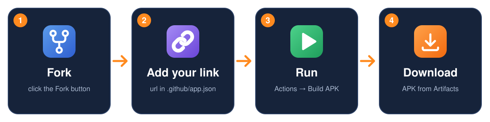
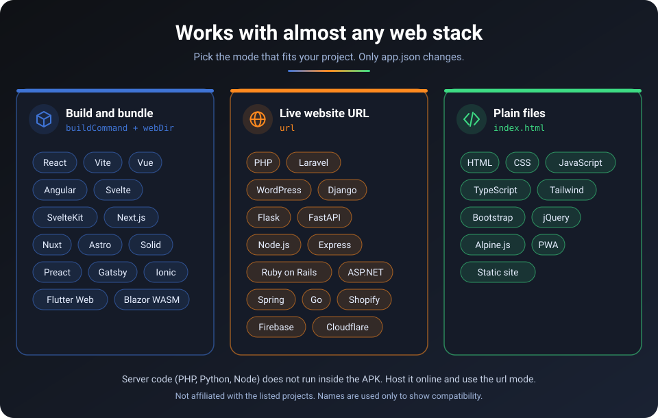

<p align="center">
  
</p>

<p align="center">
  
  
  
  
</p>

<p align="center"><b>Turn any website or web project into an Android APK using GitHub Actions.</b><br>
No Android Studio, no local setup. Fork, add your link, run.</p>

---

> [!IMPORTANT]
> **Two ways to use Web2APK:**
> **1)** Fork this repo → uses the root `.github` folder → [**read `.github/README_repo_guide.md`**](.github/README_repo_guide.md)
> **2)** Copy into your own project repo → uses the **`setup/.github`** folder → [**read `setup/README.md`**](setup/README.md)
>
> **Uploading files to your own project? Do NOT use the root `.github` folder. Use `setup/.github`.**

---

## ⚡ Easy setup (recommended, 3 steps)

> [!TIP]
> **No files to copy.** Fork this repo, add your app (`app.json` + `icon.png`) and list it in `run.json`, press **Run workflow**. That's it.

<p align="center">
  
</p>

###  1. Fork this repo
Click **Fork** (top right of this page).

###  2. Add your live link
In your fork, make a folder inside `.github/` (e.g. `my-app`). Put your `app.json` (start from `.github/example.app.json`) and `icon.png` in it, and set:

```json
{
  "appName": "My Shop",
  "appId": "com.me.shop",
  "url": "https://my-shop.com"
}
```

- `url` → the **live link** of your site. The app always shows the live site.
- `buildCommand` (+ `webDir`) → only if your site's **source code is inside the fork** and needs a build, e.g. `"buildCommand": "npm ci && npm run build", "webDir": "dist"`.
- Your logo goes in `icon.png` (square, 1024×1024 is best).
- Then list the folder in `.github/run.json`:

```json
{ "source": "clone", "builds": ["my-app"] }
```

- `source: "clone"` → the official Web2APK release is used. `source: "."` → the build script from **your fork** is used.
- List several folders in `builds` to build **several APKs at once**.

###  3. Run it, then download
Open **Actions**, press **I understand my workflows, go ahead and enable them**, choose **Build APK → Run workflow**.
When it turns green: **Build APK → (latest run) → Artifacts → `apk-my-app`**. Download, unzip, install. Done.

> Saving `app.json` on `main` also starts a build automatically. For a different app, change only its `app.json` and `icon.png`.

📖 **More details (all options, `source`, release version): [.github/README_repo_guide.md](.github/README_repo_guide.md)**

<details>
<summary>Prefer the terminal? (GitHub CLI)</summary>

```bash
gh repo fork bhawan-kavinda/Web2APK --clone
# add .github/my-app/app.json + icon.png, list it in .github/run.json, then:
git add -A && git commit -m "my app" && git push
gh workflow run "Build APK"
gh run watch
gh run download -n apk-my-app
```
</details>

---

## 🛠 Advanced setup (copy the workflow into your own project)

Use this when your web project already lives in **its own repo** and you want the APK built there instead of in a fork.

> [!WARNING]
> **Copy the `setup/.github` folder, NOT the root `.github` folder.** The root one is only for forks and multi-app builds.
> This way builds **one APK** from one `app.json` + one `icon.png`, always with the official release.
>
> 📦 **Ready-made zip (always the newest release): [web2apk-setup.zip](https://github.com/bhawan-kavinda/Web2APK/releases/latest/download/web2apk-setup.zip)**

📖 **More details: [setup/README.md](setup/README.md)**

<table>
  <tr>
    <td align="center" width="25%"><br><b>1. Copy</b><br><sub>the <code>.github</code> folder from<br><a href="https://github.com/bhawan-kavinda/Web2APK/releases/latest/download/web2apk-setup.zip">web2apk-setup.zip</a></sub></td>
    <td align="center" width="25%"><br><b>2. Edit</b><br><sub><code>app.json</code> and<br><code>icon.png</code></sub></td>
    <td align="center" width="25%"><br><b>3. Push</b><br><sub>to <code>main</code> or<br><code>master</code></sub></td>
    <td align="center" width="25%"><br><b>4. Download</b><br><sub>your APK from<br>Actions &rarr; Artifacts</sub></td>
  </tr>
</table>

**1. Download the zip and copy its `.github` folder**
Download **[web2apk-setup.zip](https://github.com/bhawan-kavinda/Web2APK/releases/latest/download/web2apk-setup.zip)** (always the newest release), unzip it, and copy the **`.github`** folder from it into the **root of your web project**, next to your `index.html`.

> The folder name starts with a dot, so it may look hidden. Turn on "show hidden files" in your file manager.

```
your-web-project/
├── index.html
├── ...your site files
└── .github/                ← from web2apk-setup.zip
    ├── workflows/
    │   └── build-apk.yml   ← leave as is
    ├── app.json            ← edit this
    └── icon.png            ← replace with your logo
```

**2. Edit two files**
- `.github/app.json` → app name, package id, version (see the Settings table below)
- `.github/icon.png` → your app icon (square, 1024×1024 is best)

**3. Push to GitHub**
Push to the `main` or `master` branch (or run the workflow by hand).
Then open:

> **Actions → Build APK → (latest run) → Artifacts → apk**

Download it, unzip, install. Done.

> **Want a different app?** Change only `app.json` and `icon.png`.

---

## What if I skip something?

| Missing | What happens |
|---|---|
| `app.json` | Web2APK's default settings are used |
| `icon.png` | Web2APK's default icon is used |
| `index.html` in your project | A simple placeholder page is bundled |

---

## Supported languages and frameworks

<p align="center">
  
</p>

Web2APK wraps a **web app**, so the language does not matter. Only the way you connect the site changes.


| Your project | Mode | What to set in `app.json` |
|---|---|---|
| React, Vite, Vue, Angular, Svelte, Next.js (static export), Astro, Nuxt (generate) | Build and bundle | `buildCommand` + `webDir` |
| PHP, Laravel, WordPress, Django, Flask, Node.js, Rails, ASP.NET, Shopify | Live website URL | `url` |
| HTML, CSS, JavaScript, jQuery, Tailwind, Bootstrap, PWA | Plain files | nothing (auto-detected) |

Examples:

```json
{ "appName": "My React App", "appId": "com.me.react", "buildCommand": "npm ci && npm run build", "webDir": "dist" }
```

```json
{ "appName": "My Laravel Site", "appId": "com.me.laravel", "url": "https://my-site.com" }
```

Common `webDir` values: Vite / Vue = `dist`, Create React App = `build`, Astro = `dist`, Angular = `dist/<project-name>`.

> **Note:** Server code (PHP, Python, Node backend) does not run inside the APK. Host it online and use the `url` mode.

---

##  Settings (`app.json`)

Only change what you need. Missing keys use the defaults. Keys starting with `_` are notes and are ignored.

| Key | Meaning | Default |
|---|---|---|
| `appName` | Name under the app icon | `Web2APK App` |
| `appId` | Unique package name, e.g. `com.me.myapp` (use a new one for each app) | `com.web2apk.app` |
| `versionName` | Version shown to users | `1.0.0` |
| `versionCode` | Whole number, **must increase** with every release | `1` |
| `apkName` | Output file name, without `.apk` | from `appName` |
| `url` | Load a **live website** instead of bundling files, e.g. `https://example.com` | empty |
| `webDir` | Folder with the built site (empty = auto-detect `dist`, `build`, `www`, `public`, then root, then `docs`) | empty |
| `buildCommand` | Run before bundling, e.g. `npm ci && npm run build` | empty |
| `allowNavigation` | Hosts allowed inside the app. Other links open in the browser. Wildcards work: `*.example.com` | localhost only |
| `permissions` | Extra Android permissions, e.g. `["CAMERA", "ACCESS_FINE_LOCATION"]` | none |
| `orientation` | `default`, `portrait` or `landscape` | `default` |
| `backgroundColor` | Icon and app background colour | `#0f1115` |
| `splashColor` | Splash screen colour while the app starts. Your icon is shown in the middle | same as `backgroundColor` |
| `offlinePage` | With `url`: show a "No connection" page with a retry button when the site cannot be loaded | `true` |
| `androidScheme` / `allowCleartext` | `https` or `http` / allow plain `http://` traffic | `https` / `true` |

Minimal example:

```json
{ "appName": "My Shop", "appId": "com.me.shop", "url": "https://my-shop.com" }
```

---

##  Common cases

**My site is already online** → set `url` to its address. The app always shows the live site, so you don't need to rebuild when the site changes.

**My site needs a build (React, Vite, etc.)** → set `buildCommand` (e.g. `npm ci && npm run build`) and `webDir` (e.g. `dist`).

**My site has a payment page on another domain** → add that domain to `allowNavigation` (e.g. `*.stripe.com`), otherwise the checkout opens in the browser.

**I need camera or location** → add `CAMERA` / `ACCESS_FINE_LOCATION` to `permissions`.

---

##  Signing key (optional, needed for updates and Play Store)

By default every build uses a **temporary key**. The APK installs fine, but Android will **not** accept it as an *update* over an APK built with a different key.

If you release updates or publish to the Play Store, use one fixed key:

1. Create it once:
   ```bash
   keytool -genkeypair -v -keystore my.keystore -alias myalias -keyalg RSA -keysize 2048 -validity 10000
   base64 -w0 my.keystore
   ```
2. In your web repo go to **Settings → Secrets and variables → Actions → New repository secret** and add:

   | Secret | Value |
   |---|---|
   | `KEYSTORE_BASE64` | the base64 text from above |
   | `KEYSTORE_PASSWORD` | your keystore password |
   | `KEY_ALIAS` | `myalias` |
   | `KEY_PASSWORD` | optional, defaults to the keystore password |

Never commit your keystore or passwords.

---

##  Troubleshooting

- **The `.github` folder is invisible:** names starting with a dot are hidden. Turn on "show hidden files". On the GitHub website use **Add file → Create new file** and type `.github/workflows/build-apk.yml` as the name.
- **Fork: no Run workflow button:** forks start with Actions turned off. Open the **Actions** tab and enable workflows first.
- **No workflow runs:** check that you pushed to `main` or `master` and that Actions are enabled in your repo.
- **Build fails:** open the failed run and read the red error line. Most errors are a typo in `app.json` (e.g. an invalid `appId`).
- **Blank screen in the app:** with `url`, the site must be online; without it, make sure `index.html` (or your `webDir`) exists.

---

##  How it works

Your workflow gets the Web2APK build script, reads your `app.json` and `icon.png`, wraps your site with [Capacitor](https://capacitorjs.com), builds and signs a release APK, and uploads it as an artifact in **your own** Actions tab.

- **Own project (`setup/`)**: the build script is always cloned from the newest **official release tag**.
- **Fork (root `.github`)**: `run.json` → `"source": "clone"` uses the official release, `"source": "."` uses the script from your fork.

```
.github/                          for forks / multi-app (see .github/README_repo_guide.md)
setup/.github/                    the folder to copy into your own project (see setup/README.md)
scripts/build.mjs                 the whole build
defaults/                         fallback app.json and icon.png
placeholder/index.html            page used when no site is found
defaults/offline.html             "No connection" page template (url mode)
assets/                           README banner, logo and icons
example.env                       signing variables (for local builds)
```
